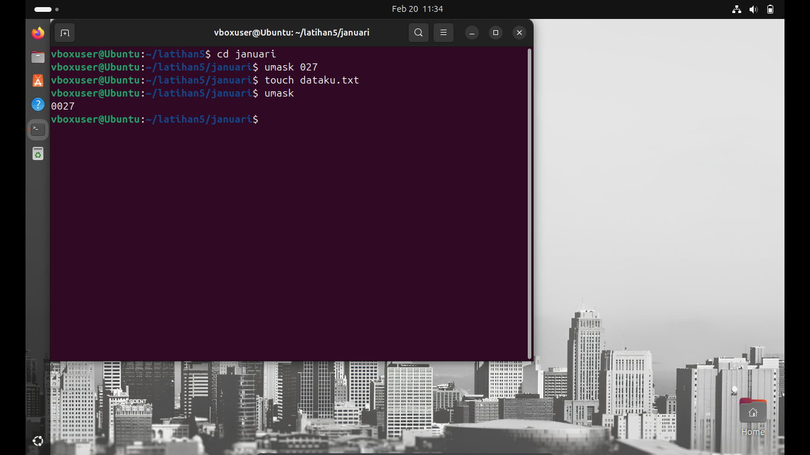

📌Laporan Praktikum 3 Sistem Operasi

Nama : M. Rizky Taufik Nur Hidayat

NIM  : 09030582327076

Kelas: TK4B

<h1>Sistem File</h1>

<ol>
<li>Perintah ls -l /dev | grep ^c akan menampilkan daftar character device di direktori /dev.</li>

<li>mkdir -p digunakan agar direktori dibuat secara rekursif jika latihan5 belum ada.  
{januari,februari,maret} digunakan untuk membuat tiga direktori sekaligus.</li>

<li>Membuat File dataku di Januari dan Menyalinnya ke Februari dan Maret  
  echo -e digunakan untuk membuat file dataku dengan isi yang diinginkan. 
cp digunakan untuk menyalin file ke subdirektori Februari dan Maret.</li>

<li>Mengubah Izin Akses File dataku di Januari agar Group dan Others Bisa Write dengan code 666</li>

<li>Mengubah Izin Akses File dataku di Februari (User: rwx, Group & Others: rx) dengan code 755</li>

<li>Mengubah Izin Akses File dataku di Maret agar Semua Bisa Read, Write, Execute dengan code 777</li>

<li>Menghapus Direktori Maret dengan komen rm -r</li>

<li>Mengubah Kepemilikan Subdirektori Februari agar User & Group Hanya Bisa Read 
chmod 444 membuat subdirektori hanya bisa dibaca oleh user dan group (r--r--r--). 
Setelah itu, coba buat direktori haha dalam februari, yang seharusnya gagal karena tidak ada izin menulis.</li>

<li>Mengubah umask untuk File dataku di Januari ke 027 dan Melihat Nilai Default-nya</li>

<li>Membuat Link ke dataku dengan Nama dataku.ini dan dataku.juga  
ln membuat hard link ke file dataku. 
ls -l akan menampilkan jumlah link yang ada pada file (dataku seharusnya memiliki 3 link).</li>

</ol>
